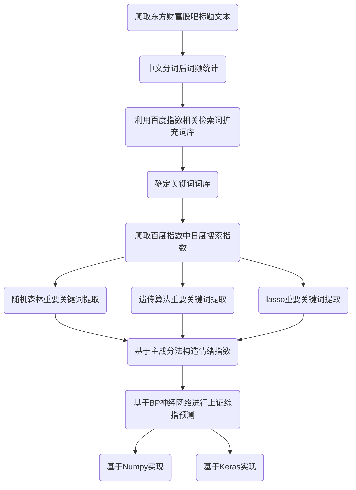

# 1 研究思路



# 2 数据采集

## 2.1 爬取东方财富网股吧标题

​	首先要建立初始候选词库。本文选取东方财富网“股吧”中的“上证综指”吧10000页发帖标题，总标题数超过90000。由于爬虫数据具有时效性，本文最后一次数据采集时间为6月10日。

```python
import requests
from bs4 import BeautifulSoup
from tqdm import tqdm
import time
import pandas as pd
import os

os.chdir("C:\\Users\\Simmons\\PycharmProjects\\数据挖掘大作业")

# 设置cookie
Cookie =  # 填写cookie


def get_info(u):
    """
    :param : 获取标题数据的url
    :return: 获得的标题数据和发布时间
    """
    url = u
    # 设置requests请求的 headers
    headers = {
        'User-agent': "Mozilla/5.0 (Windows NT 10.0; Win64; x64) AppleWebKit/537.36 (KHTML, like Gecko) Chrome/80.0.3987.106 Safari/537.36",
        # 设置get请求的User-Agent，用于伪装浏览器UA
        'Accept': 'text/html,application/xhtml+xml,application/xml;q=0.9,image/webp,image/apng,*/*;q=0.8,application/signed-exchange;v=b3;q=0.9',
        'Cookie': Cookie,
        'Connection': 'keep-alive',
        'Accept-Encoding': 'gzip, deflate',
        'Accept-Language': 'zh-CN,zh;q=0.9',
        'Host': 'guba.eastmoney.com',
    }
    req = requests.get(url, headers=headers)
    str_data = req.content
    ns = BeautifulSoup(str_data, 'html.parser')
    title = ns.find_all("span", attrs={"class": "l3 a3"})
    mtime = ns.find_all("span", attrs={"class": "l5 a5"})
    return title, mtime


results = []
for i in tqdm(range(10000)):
    url = 'http://guba.eastmoney.com/list,zssh000001_{0}.html'.format(i)
    review_title, review_time = get_info(url)
    for tit in review_title:
        results.append(tit.text)
    time.sleep(0.5)

data_out = pd.DataFrame(columns=['title'])
data_out['title'] = results
data_out.to_csv('东方财富股吧标题.csv', index=None)
```

​	东方财富网向来以不反爬、信息抓取便捷著称，标题信息在网页源代码中直接显示，通过BeautifulSoup解析后得到标题信息和发布时间（确定时间范围）。

​	本部分数据采集耗时较长，利用tqdm库进行进度跟踪，总耗时约2小时。所得结果通过pandas储存到csv。输出结果为共923313个标题。

## 2.2 中文分词后词频统计

​	这一步从标题文本中提取频繁出现的关键词，首先利用jieba库进行中文分词。

```python
data1 = pd.read_csv('./data_base/东方财富股吧标题.csv')
text = list(data1.title)
text = ','.join(text)

tl = jieba.lcut_for_search(text,HMM=True)
textdf = pd.DataFrame(columns=['text'])
textdf['text'] = tl
count = textdf['text'].value_counts()
```

​	分词结束后进行停用词过滤，再用pandas的value_counts方法进行词频出现的统计。

```python
stop = open('./data_base/stop_word.txt', 'r+', encoding='utf-8')
stopword = stop.read().split("\n")

wordlist = []
for key in tqdm(tl):
    if key not in stopword:
        if key !=' ':
            wordlist.append(key)

textdf = pd.DataFrame(columns=['text'])
textdf['text'] = wordlist
count = textdf['text'].value_counts()
count = count.reset_index()
count.to_csv('./data_out/词频统计.csv',index=None)
```

​	确定了初步的关键词词库后，进行词云的绘制。词云绘制采用echarts进行绘制。

```python
count_tuples = [tuple(xi) for xi in count.values]
del count_tuples[0]
c = (
    WordCloud()
    .add("", count_tuples, word_size_range=[10, 100], shape=SymbolType.DIAMOND)
    .set_global_opts(title_opts=opts.TitleOpts(title="东方财富"))
    .render("东方财富.html")
)
```


## 2.3 关键词词库扩充

​	这一步主要的工具是百度指数中需求图谱中的相关词热度功能。登录之后获得cookie，获得初始关键词词库中词频前1000的关键词对应的相关词的搜索热度，搜索变化率，相关性之后，按每个相关词将信息字典储存到dataframe中。为防止ip被封，设置请求间隔为2秒。此处耗时较长。

```python
data_text = pd.read_csv('./data_out/词频统计.csv')

data_rel = pd.DataFrame(columns=['origin', 'word', 'pv', 'ratio', 'sim'])
for word in tqdm(data_text['index'].head(1000)):
    try:
        a = getMulti(word)
        for item in a:
            item['origin'] = word
            data_rel = data_rel.append(item, ignore_index=True)
    except:
        pass
    time.sleep(2)
```

​	这一步中用到的函数构造如下，百度指数网页为动态加载，在network中寻找数据包，发现返回的是json格式数据，get_rep_json函数或者json格式的数据。getMulti函数以字典的形式进行提取。

```python
def get_rep_json(url):
    """
    获取json
    :param url: 请求接口
    :return: json数据
    """
    hearder = {
        "Cookie": ,  # 填写游览器中的cookie
        "User-Agent": "Mozilla/5.0 (Windows NT 6.1; Win64; x64) AppleWebKit/537.36 (KHTML, like Gecko) Chrome/76.0.3809.100 Safari/537.36"
    }
    response = requests.get(url, headers=hearder)
    response_data = response.json()
    # print(response_data)
    return response_data


def getMulti(word):
    """
    :param word: 搜索的关键词
    :return: 需求图谱中的pv搜索热度；ratio搜索变化率；sim相关性
    """
    url = f"http://index.baidu.com/api/WordGraph/multi?wordlist%5B%5D={word}"
    word_data = get_rep_json(url)['data']['wordlist'][0]
    return word_data['wordGraph']
```

​	利用相关词检索之后再次建立关键词词库，进行词频统计和部分无关词的剔除后，确立最终关键词词库，绘制词云图。

```python
freq = data_rel['word'].value_counts()
freq.to_excel('关联词词频.xlsx', encoding='gbk')


from pyecharts import options as opts
from pyecharts.charts import WordCloud
from pyecharts.globals import SymbolType
data_word = pd.read_excel('关联词词频.xlsx', encoding='gbk')

count_tuples = [tuple(xi) for xi in data_word.values]
c = (
    WordCloud()
    .add("", count_tuples, word_size_range=[10, 100], shape=SymbolType.DIAMOND)
    .set_global_opts(title_opts=opts.TitleOpts(title="最后关键词词库"))
    .render("./fig/最终关键词词库.html")
)
```


## 2.4 爬取百度指数中日度搜索指数

​	接下来是数据采集的最后一步——获取日度搜索指数。同样在network中找数据包，构造函数如下， getIndex可正常返回数据，搜索指数的抓取有以下几个特点需要注意：

- 当间隔时间超过366天后，返回数据变成周度数据，不再是日度数据。

- 将关键词嵌入url的字符串中时，不可将原url中的双引号变成单引号，需要对引号特殊处理。

- url可正常返回数据，但是数据被进行了加密。

  getPtbk函数找到解密所需的key，decrypt_py函数利用key和加密数据进行解密，返回解密后的搜索指数日度序列。

```python
def getPtbk(uniqid):
    """
    :param uniqid: 指数数据网址中指向密钥的uniqid
    :return: key
    """
    url = f"http://index.baidu.com/Interface/ptbk?uniqid={uniqid}"
    return get_rep_json(url)['data']


def decrypt_py(t, e):
    """
    :param t:
    :param e:
    :return: 解析出来的数据
    """
    a = dict()
    length = int(len(t) / 2)
    for o in range(length):
        a[t[o]] = t[length + o]
    r = "".join([a[each] for each in e]).split(",")

    return r

def getIndex(word):
    """
        搜索指数
        :param word:所搜索的关键词
        :return:搜索指数日度时间序列
        """
    url = f"http://index.baidu.com/api/SearchApi/index?word=[[%7B%22name%22:\"{word}\",%22wordType%22:1%7D]]&area=0&startDate=2019-06-01&endDate=2020-05-31"
    rep_json = get_rep_json(url)
    uniqid = rep_json['data']['uniqid']
    all_index_e = rep_json['data']['userIndexes'][0]['all']['data']
    t = getPtbk(uniqid)
    return decrypt_py(t, all_index_e)
```

​	百度指数中还包含了资讯指数和媒体指数，所对应的url和json数据格式不同，此处以资讯指数为例，仅提供函数，不后续使用。

```python
def getFeedIndex(word):
    """
    :param word: 关键词
    :return: 资讯指数
    """
    url = f"http://index.baidu.com/api/FeedSearchApi/getFeedIndex?word=[[%7B%22name%22:\"{word}\",%22wordType%22:1%7D]]&area=0&startDate=2019-06-01&endDate=2020-05-31"
    feed_index_data = get_rep_json(url)
    uniqid = feed_index_data['data']['uniqid']
    data = feed_index_data["data"]['index'][0]
    e = data['data']
    t = getPtbk(uniqid)
    return decrypt_py(t, e)
```

​	去最终关键词词库中前140个关键词，完成数据采集工作。此处请求时间间隔为3秒，耗时较长，大约7分钟。

```python
data_word = pd.read_excel('关联词词频.xlsx', encoding='gbk')
word_list = list(data_word['word'])[0:139]

word_dict = {}
for w in tqdm(word_list):
    try:
        a = getIndex(w)
        word_dict[w] = a
    except :
        pass
    time.sleep(3)

word_df = pd.DataFrame(dict([(k, pd.Series(v)) for k, v in word_dict.items()]))
word_df.to_excel('./data_out/搜索指数.xlsx', encoding='gbk', index=None)
```

# 3 情绪指数指数建立

## 3.1 数据处理

​	在数据采集部分完成后，我们获得了140个关键词366天的搜索指数。这一部分将在数据处理后进行特征选择，接着利用主成分法建立情绪指数。

​	从wind数据库获取2019年6月1日至2020年5月31日的上证综指收盘价（前复权）。利用merge函数与关键词库进行整合。保留了242个交易日的数据。部分日期部分关键词搜索指数缺失，用0填补。

```python
os.chdir("C:\\Users\\Simmons\\PycharmProjects\\数据挖掘大作业")
data_index = pd.read_excel('./data_base/搜索指数.xlsx', encoding='gbk')
data_stock = pd.read_excel('./data_base/上证综指.xlsx', encoding='gbk')

tm = pd.date_range('20190601', periods=366, freq='D')
data_index['time'] = tm
data_base = data_stock.merge(data_index, on='time')

data_base.isnull().sum().sum()
data_base = data_base.fillna(0)
```

## 3.2 特征选择

### 3.2.1 随机森林回归

​		利用sklearn库进行随机森林回归。首先划分出训练集和测试集，在树方法中，不需要进行归一化或标准化处理。输出随机森林中变量的相对重要性。利用pandas对整合后的数据和随机森林回归的结果进行储存。

```python
from sklearn.model_selection import train_test_split
from sklearn.ensemble import RandomForestRegressor

x, y = data_base.iloc[:, 2:].values, data_base.iloc[:, 1].values
x_train, x_test, y_train, y_test = train_test_split(x, y, test_size=0.1, random_state=0)
feat_labels = data_base.columns[2:]
forest = RandomForestRegressor(n_estimators=1000)
forest.fit(x_train, y_train)

importance = forest.feature_importances_
ser = pd.Series(importance.tolist())
ser.index = feat_labels
result = ser.sort_values()
result = result.reset_index()

data_base.to_csv('./data_base/回归数据.csv', encoding='gbk', index=None)
result.to_csv('./data_base/随机森林选择.csv', encoding='gbk',index=None)
```

### 3.2.2 遗传算法

​	基于遗传算法的特征选择是一种wrapper的方法，将候选对象编码为一条染色体，在特征选择中，如果目标从D个特征d个，则把所有的特征描述为一条染色体，在特征选择中，如果目标是D个特征中选择d个，则把所有特征描述为一条由D个0/1字符组成的字符串，0表示该特征没有被选中，1表示该特征被选中，这个字符串就是染色体m。要求的是一条有且仅有d个1的染色体。优化的目标被描述为适应度函数。每一条染色体对应一个适应度。

​	首先建立Life类，用于初始化生命值。

```python
SCORE_NONE = -1


class Life(object):
      def __init__(self, aGene=None):
            self.gene = aGene
            self.score = SCORE_NONE  # 初始化生命值 
```

​	之后建立遗传算法类。

```python
import copy
import random
from src.Life import Life
import numpy as np

class GA(object):
    """遗传算法类"""

    def __init__(self, aCrossRate, aMutationRage, aLifeCount, aGeneLenght, aMatchFun=lambda life: 1):
        self.croessRate = aCrossRate  # 交叉概率 #
        self.mutationRate = aMutationRage  # 突变概率 #
        self.lifeCount = aLifeCount   # 个体数 #
        self.geneLenght = aGeneLenght  # 基因长度 #
        self.matchFun = aMatchFun  # 适配函数
        self.lives = []  # 种群
        self.best = Life(np.random.randint(0, 2, self.geneLenght))  # 保存这一代中最好的个体

        self.gene = np.random.randint(0, 2, self.geneLenght)  # 保存全局最好的个体 #
        self.score = -1   # 保存全局最高的适应度 #

        self.generation = 0  # 第几代 #
        self.crossCount = 0  # 交叉数量 #
        self.mutationCount = 0  # 突变个数 #
        self.bounds = 0.0  # 适配值之和，用于选择时计算概率
        self.initPopulation()  # 初始化种群 #

    def initPopulation(self):
        """初始化种群"""
        self.lives = []
        count = 0
        while count < self.lifeCount:
            gene = np.random.randint(0, 2, self.geneLenght)
            life = Life(gene)
            random.shuffle(gene)  # 随机洗牌 #
            self.lives.append(life)
            count += 1

    def judge(self):
        """评估，计算每一个个体的适配值"""
        self.bounds = 0.0
        self.best.score = copy.deepcopy(self.score) 
        self.best.gene = copy.deepcopy(self.gene)
        for life in self.lives:
            life.score = self.matchFun(life)
            self.bounds += life.score
            if self.best.score < life.score:     # score为auc 越大越好 #
                self.best = life

        if self.score < self.best.score:                          
            self.score = copy.deepcopy(self.best.score)           
            self.gene = copy.deepcopy(self.best.gene)             

    def cross(self, parent1, parent2):
        """
        函数功能：交叉
        """
        index1 = random.randint(0, self.geneLenght - 1)  # 随机生成突变起始位置 #
        index2 = random.randint(index1, self.geneLenght - 1)  # 随机生成突变终止位置 #

        for index in range(len(parent1.gene)):
            if (index >= index1) and (index <= index2):
                parent1.gene[index], parent2.gene[index] = parent2.gene[index], parent1.gene[index]

        self.crossCount += 1
        return parent1.gene

    def mutation(self, gene):
        """突变"""
        index1 = random.randint(0, self.geneLenght - 1)
        index2 = random.randint(0, self.geneLenght - 1)
        # 随机选择两个位置的基因交换--变异 #
        newGene = gene[:]  # 产生一个新的基因序列，以免变异的时候影响父种群
        newGene[index1], newGene[index2] = newGene[index2], newGene[index1]
        self.mutationCount += 1
        return newGene

    def getOne(self):
        """选择一个个体"""
        r = random.uniform(0, self.bounds)
        for life in self.lives:
            r -= life.score
            if r <= 0:
                return life

        raise Exception("选择错误", self.bounds)

    def newChild(self):
        """产生新的后代"""
        parent1 = self.getOne()
        rate = random.random()

        # 按概率交叉 #
        if rate < self.croessRate:
            # 交叉 #
            parent2 = self.getOne()
            gene = self.cross(parent1, parent2)
        else:
            gene = parent1.gene

        # 按概率突变 #
        rate = random.random()
        if rate < self.mutationRate:
            gene = self.mutation(gene)

        return Life(gene)

    def next(self):
        """产生下一代"""
        self.judge()
        newLives = []
        newLives.append(self.best)  # 把最好的个体加入下一代 #
        newLives[0].gene = copy.deepcopy(self.gene)
        newLives[0].score = copy.deepcopy(self.score)
        while len(newLives) < self.lifeCount:
            newLives.append(self.newChild())
        self.lives = newLives
        self.generation += 1
```

​	接下来进行特征选择。

```python
import numpy as np
import pandas as pd
from src.Genetic_algorithm import GA
import matplotlib.pyplot as plt
from sklearn import linear_model
from sklearn.metrics import mean_squared_error
import os

os.chdir("C:\\Users\\Simmons\\PycharmProjects\\数据挖掘大作业")


class FeatureSelection(object):
    def __init__(self, aLifeCount=10):
        self.columns =  \
            ['target', 'A股', '回升', '湖北', '涨停', '恒生指数', '道琼斯', '平仓', '补', '建仓',
             '量比', '头寸', '跌停', '空头', '港股', '多头', '上涨', '股票', '蓝筹股', '套牢', '上海', '上证',
             '绩优股', '淘宝', '涨停板', '牛股', '升值', '熊市', '成分股', '放量', '股市', '效益', '财产', '期货',
             '妖股', '换手率', '利空', 'K线', '调节', '上证指数', '收盘价', '创业板指数', '概念股', '原油',
             '企业上市', '华南', '多头和空头什么意思', '开盘价', '股份有限公司', '增幅', '恒生', '盈利',
             '损失', '利润率', '熔断', '股票成交量', '证券公司是做什么的', '三板市场', '债券', '高中生炒股赚4.5亿',
             '证券投资基金', '毛利', '补仓', '流通股', '波动', '净利率', '创业板指', '半导体芯片', '休市', '黄金',
             '可转债', '战略管理', '股东', '盘整', '日内交易者', '新基建', '资产', 'ST股', '投资', '量价关系', '持仓',
             '抛售', '成交量', '爆仓', '创业板', '市盈率', '涨停是什么意思', '短线', '期货K线', '做多', '美股熔断',
             '保险', '空仓', 'A股市场', '洗盘', '科技股', '做空', '量比是什么意思', '外围市场', '炒股', '投行',
             '沪深300', '振幅', '石油', '缩量下跌', '空头头寸', '技术分析', '委比', '股票基础', '牛市', '放量上涨',
             '指数基金', '到期日', '收盘时间', '白马股', '崩盘', '反弹', '道琼斯指数', 'B股', 'MACD', '商业银行',
             '科技资讯', '跌停是什么意思', '日经225指数', '股票基础知识入门', '证券基础知识', '重组', '折价率',
             '买空', '香港股市', '营业收入', '大盘', '调研报告', '回落', '证券开户']
        self.train_data = pd.read_excel('./data_base/train_feature.xlsx')
        self.validate_data = pd.read_excel('./data_base/validate_feature.xlsx')
        self.lifeCount = aLifeCount
        self.ga = GA(aCrossRate=0.7,
                     aMutationRage=0.1,
                     aLifeCount=self.lifeCount,
                     aGeneLenght=len(self.columns) - 1,
                     aMatchFun=self.matchFun())

    def mean_error_score(self, order):
        print(order)
        features = self.columns[1:]
        features_name = []
        for index in range(len(order)):
            if order[index] == 1:
                features_name.append(features[index])

        y_train = np.array(self.train_data['target'], dtype=np.float)
        reg = linear_model.LinearRegression()
        reg.fit(self.train_data[features_name], y_train)
        y_test = np.array(self.validate_data['target'], dtype=np.float)
        y_pred = reg.predict(self.validate_data[features_name])
        score = mean_squared_error(y_test, y_pred)
        score = 1 / score
        return score

    def matchFun(self):
        return lambda life: self.mean_error_score(life.gene)

    def run(self, n=0):
        distance_list = [ ]
        generate = [ index for index in range(1, n + 1) ]
        while n > 0:
            self.ga.next()
            # distance = self.auc_score(self.ga.best.gene)
            distance = self.ga.score
            distance_list.append(distance)
            print(("第%d代 : 当前最好特征组合的线下验证结果为：%f") % (self.ga.generation, distance))
            n -= 1

        print('当前最好特征组合:')
        string = []
        flag = 0
        features = self.columns[1:]
        for index in self.ga.gene:
            if index == 1:
                string.append(features[flag])
            flag += 1
        print(string)
        print('线下最高为均方误差的倒数：', self.ga.score)

        '''画图函数'''
        plt.plot(generate, distance_list)
        plt.xlabel('generation')
        plt.ylabel('distance')
        plt.title('generation--mean-error-score')
        plt.show()
        plt.savefig('./fig/遗传算法选择.png')
```

​	设置算法迭代次数为100。以均方误差倒数最大作为适配函数的结果。

```python
fs = Feature_selection_genetic_algorithm.FeatureSelection(aLifeCount=20)
rounds = 100  # 算法迭代次数 #
fs.run(rounds)
```


### 3.2.3 lasso

​	此部分利用stata完成。

## 3.3 主成分法构造情绪指数

​	此处使用主成分综合得分将上一部分所得结果进行降维，选取重要性排序前25的关键词，构造情绪指数。

```python
word_list = list(data_base1['index'].tail(25))
data_base = data_base2[word_list]
data_base = (data_base - data_base.min()) / (data_base.max() - data_base.min())
data_tr = data_base.values


def pcan(dataX, datasTad, n):
    tr_cov = np.cov(datasTad, rowvar=0)
    eigenValue, eigenVector = np.linalg.eig(tr_cov)  # 求得特征值，特征向量
    sorceEigenValue = np.argsort(eigenValue)  # 特征值下标从小到大的排列顺序
    nPcaEigenVector = sorceEigenValue[-n:]  # 最大的n个特征值的下标
    pcaEigenVector = eigenVector[nPcaEigenVector]  # 选取特征值对应的特征向量
    pcaEigenValue = eigenValue[nPcaEigenVector]
    sum_value = np.sum(eigenValue)
    pcaEigenValue = pcaEigenValue/sum_value
    PCAX = np.dot(dataX, pcaEigenVector.T)  # 得到降维后的数据
    return PCAX, pcaEigenVector, pcaEigenValue


a, b, c = pcan(data_base, data_tr, 25)
fin_score = np.dot(a, c.T)
```

​	得到构建的情绪指数之后，我们将其与上证综指收盘价进行简单比较，计算其Pearson相关系数和spearman秩相关系数。在判断相关性时，不应当局限于相关系数的大小，更应关注相关系数的显著性，所得相关系数均显著。

```python
price = list(data_base2['price'])
y = stats.pearsonr(fin_score,price)
y = stats.spearmanr(fin_score,price)

y1.correlation
Out[33]: 0.3585615152319541
y1.pvalue
Out[34]: 9.408488060855104e-09
y2
Out[35]: (0.45474095421391325, 9.410460691618231e-14)
```

​	至此，情绪指数构建完成。

# 4 上证综指预测——基于BP神经网络

## 4.1 BP神经网络

​	股票价格及其相关数据虽然作为是典型的时间序列，Chollet 的《Deep Learning with Python》一书强调，人们不应该尝试使用时间序列预测方法去预测股票价格。在股市中，过去的数据并不是估计未来的一个好基础。本例仅作为探索，不深入探讨实际可行性。

​	BP（back propagation）神经网络是应用最为广泛的神经网络之一，下面参考邱锡鹏的《Neural Networks and Deep Learning》对神经网络的基本概念做一个简单的概览。

### 4.1.1 神经元

​	人工神经元是构成神经网络的基本单元，模拟生物神经元的结构和特点，接受一组输入信号，产生输出信号。

​	假设一个神经元接收$d$个输入$x_1,x_2,x_3…,x_d$，令向量$x= [x_1;x_2;x_3…x_d]$来表示输入，用净输入（net input）$z \in R$表示一个神经元所获得的输入信号$x$的加权和。

$$z= \Sigma_{i=1}^d w_ix_i+b$$

$$=w^Tx+b$$

​	$z$在经过一个非线性函数$f()$后得到神经元的激活值a。

$a= f(z)$

​	其中$f(*)$称为激活函数。

### 4.1.2 激活函数

激活函数需要具备以下性质:

- 连续可导（允许少数点上不可导）的非线性函数，保证可以直接利用数值优化的方法来学习网络参数。
- 激活函数及其导函数简单，提高计算效率。
- 激活函数的导函数值域要在一个合适的区间，不可影响训练的效率和稳定性。

常用的激活函数包括：

- sigmoid型函数。这是一类S型曲线函数，两端饱和，常用的sigmoid函数有logistic函数和tanh函数。

  $\sigma(x) = {1 \over 1+exp(-x)}$

  $tanh(x) = {exp(x)-exp(-x) \over exp(x+exp(-x))}$

- ReLU函数。修正线性单元，是目前深度神经网络中常用的激活函数，是一个斜坡函数。

$$RuLU(x)= \begin{cases} x& x \geq 0\\ 0& x<0 \end{cases}$$

- Swish函数。是一种自门控激活函数。

  $swish(x) = x \sigma (\beta x)$

### 4.1.3 前馈网络结构

​	按接收消息的先后将神经元分为不同的组。每一组可以看作一个神经层。每一层接受前一层神经元的输出，并输出到下一层神经元。前馈网络可以看作一个函数。

​	此外还有记忆网络、图网络和很多复合型结构。

​	前馈网络第0层称为输入层，最后一层称为输出层，中间层称为隐藏层。		

​	用以下记号描述一个前馈神经网络：

- $L$：神经网络层数；
- $m^{(L)}$: 第$l$层神经元个数；
- $f_L(*)$: 第$l$层神经元的激活函数；
- $W^{(L)}$: 第$l-1$层到第$l$层的权重矩阵；
- $b^{(L)}$:第$l-1$层到第$l$层的偏置；
- $z^{(L)}$ ：第$l$层神经元的净输入；
- $a^{(L)}$: 第$l$层神经元的输出（活性值）。

通过以下公式进行信息传播。

$z(l) = W(l)·a^{(l-1)}+b^{(l)},$

$a^{(l)} = f_l(z^{(l)})$

​	整个网络可以看作一个复合函数$\phi(x;W;b)$，将向量x作为第一层输入，将第L层输出作为整个函数的输出。

### 4.1.4 反向传播算法

​	此处考虑篇幅，仅文字叙述原理。

- 前馈计算出每一层的净输入$z^(l)$和激活值$a^{(l)}$，直到最后一层；
- 反向传播计算每一层的误差项$\delta ^{l}$;
- 计算每一层的梯度（偏导数）,更新参数。

## 4.2 算法实现

### 4.2.1 基于numpy实现

​	首先定义激活函数[^1], 此处定义了sigmoid和relu的前馈激活函数和反向传播函数。

[^1]:blog.csdn.net/u014303046/article/details/78200010/

```python
def sigmoid(z):
    """
    :param z: 输入
    :return: 激活值
    """
    return 1/(1 + np.exp(-z))


def relu(z):
    """
    :param z: 输入
    :return: 激活值
    """
    return np.array(z>0)*z


def sigmoidBackward(dA, cacheA):
    """
    :param dA: 同层激活值
    :param cacheA: 同层线性输出
    :return: 梯度
    """
    s = sigmoid(cacheA)
    diff = s*(1 - s)
    dZ = dA * diff
    return dZ


def reluBackward(dA, cacheA):
    """
    :param dA: 同层激活值
    :param cacheA: 同层线性输出
    :return: 梯度
    """
    Z = cacheA
    dZ = np.array(dA, copy=True) 
    dZ[Z <= 0] = 0
    return dZ
```

​	定义初始网络参数。

```python
def iniPara(laydims):
    """
    :param laydims: 输入的结构（字典）
    :return:  随机初始化的参数字典
    """
    np.random.seed(1)
    parameters = {}
    for i in range(1, len(laydims)):
        parameters['W'+str(i)] = np.random.randn(laydims[i], laydims[i-1])/ np.sqrt(laydims[i-1])
        parameters['b'+str(i)] = np.zeros((laydims[i], 1))
    return parameters
```

​	定义线性的前向传播和带激活函数的前向传播。本次探索为回归预测问题，回归问题的分类问题在输出层的结构上有所不同，本次回归预测输出层使用线性前向传播和线性反向传播。

```python
def forwardLinear(W, b, A_prev):
    Z = np.dot(W, A_prev) + b
    cache = (W, A_prev, b)
    return Z, cache


def forwardLinearActivation(W, b, A_prev, activation):
    Z, cacheL = forwardLinear(W, b, A_prev)
    cacheA = Z
    if activation == 'sigmoid':
        A = sigmoid(Z)
    if activation == 'relu':
        A = relu(Z)
    cache = (cacheL, cacheA)
    return A, cache


def forwardModel(X, parameters):
    layerdim = len(parameters)//2
    caches = []
    A_prev = X
    for i in range(1, layerdim):
        A_prev, cache = forwardLinearActivation(parameters['W'+str(i)], parameters['b'+str(i)], A_prev, 'relu')
        caches.append(cache)
        
    AL, cache = forwardLinear(parameters['W'+str(layerdim)], parameters['b'+str(layerdim)], A_prev)
    caches.append(cache)
    
    return AL, caches
```

​	前向传播函数的定义完成后，我们需要计算代价函数值。

```python
def computeCost(AL, Y):
    """
    :param AL: 输出层的激活输出
    :param Y: 实际值
    :return: 代价函数值
    """
    m = Y.shape[1]
    cost = (1./m) * (-np.dot(Y,np.log(AL).T) - np.dot(1-Y, np.log(1-AL).T))
    return cost
```

​	接下来进行反向传播，输出层采用线性反向传播。

```python
def linearBackward(dZ, cache):
    W, A_prev, b = cache
    m = A_prev.shape[1]
    
    dW = 1/m*np.dot(dZ, A_prev.T)
    db = 1/m*np.sum(dZ, axis = 1, keepdims=True)
    dA_prev = np.dot(W.T, dZ)
    
    return dA_prev, dW, db


def linearActivationBackward(dA, cache, activation):
    cacheL, cacheA = cache
    if activation == 'relu':
        dZ = reluBackward(dA, cacheA)
        dA_prev, dW, db = linearBackward(dZ, cacheL)
    elif activation == 'sigmoid':
        dZ = sigmoidBackward(dA, cacheA)
        dA_prev, dW, db = linearBackward(dZ, cacheL)
    return dA_prev, dW, db


def backwardModel(AL, Y, caches):
    layerdim = len(caches)
    Y = Y.reshape(AL.shape)
    L = layerdim
    
    diffs = {}
    
    dAL = - (np.divide(Y, AL) - np.divide(1 - Y, 1 - AL))
    
    currentCache = caches[L-1]
    dA_prev, dW, db =  linearBackward(dAL, currentCache)
    diffs['dA' + str(L)], diffs['dW'+str(L)], diffs['db'+str(L)] = dA_prev, dW, db
    
    for l in reversed(range(L-1)):
        currentCache = caches[l]
        dA_prev, dW, db =  linearActivationBackward(dA_prev, currentCache, 'relu')
        diffs['dA' + str(l+1)], diffs['dW'+str(l+1)], diffs['db'+str(l+1)] = dA_prev, dW, db
        
    return diffs
```

​	利用反向传播得到的梯度，进行参数更新。

```python
def updateParameters(parameters, diffs, learningRate):
    layerdim = len(parameters)//2
    for i in range(1, layerdim+1):
        parameters['W'+str(i)] -= learningRate*diffs['dW'+str(i)]
        parameters['b'+str(i)] -= learningRate*diffs['db'+str(i)]
    return parameters
```

​	整合上述过程，并给出预测函数。

```python
def finalModel(X, Y, layerdims, learningRate=0.01, numIters=5000,pringCost=False):
    np.random.seed(1)
    costs = []
    parameters = iniPara(layerdims)
    
    for i in range(0, numIters):
        AL, caches = forwardModel(X, parameters)
        cost = computeCost(AL, Y)
        
        diffs = backwardModel(AL,Y, caches)
        parameters = updateParameters(parameters,diffs, learningRate)
    
        if pringCost and i%100 == 0:
            costs.append(np.sum(cost))
    return parameters


def predict(X, parameters):
    a, b = forwardModel(X, parameters)
    return a, b
```

​	在完成了上述函数的定义后，进行模型的训练。首先对数据进行划分和标准化， 为防止信息泄露，先划分后标准化。

```python
data = pd.DataFrame({'y':price[4:],'x1':price[3:-1],'x2':price[2:-2],'x3':price[1:-3],'x4':price[0:-4],'x5':fin_score[3:-1],'x6':fin_score[2:-2]})
# 先划分训练集和测试集，再进行归一化
data_train = data.head(220)
data_test = data.tail(18)
data_train = (data_train - data_train.min()) / (data_train.max() - data_train.min())
data_test = (data_test - data_test.min()) / (data_test.max() - data_test.min())

x_train, y_train, x_test, y_test = data_train.iloc[:, 1:].values, data_train.iloc[:, 0].values,data_test.iloc[:, 1:].values, data_test.iloc[:, 0].values
```

​	由于该神经网络模型搭建较为简单，预测能力不是很好，此处仅给出训练示例和结果，参数优化过程将在基于keras实现的部分给出。

```python
import src.bp as bp

trainX = x_train.T
testX = x_test.T
trainY = y_train.reshape(1, 220)
testY = y_test.reshape(1, 18)

structure = [6, 20, 12, 12, 1]
para = bp.finalModel(trainX, trainY, structure, learningRate=0.001, numIters=10000, pringCost=False)
predTrain, accTrain = bp.predict(trainX, para)
predTest, accTest = bp.predict(testX, para)

pre = pd.DataFrame({'y': y_train, 'p': predTrain[0, :]})
r_s = r_square(x.y, x.p)
r_t = r_square(test.y, test.p)
r_p = r_square(pre.y, pre.p)

pre.plot.line()
plt.show()
pretest = pd.DataFrame({'y': y_test, 'p': predTest[0, :]})
pretest.plot.line()
plt.show()
```


### 4.2.2 基于keras实现

​	此处基于keras构造bp神经网络。首先对数据进行划分和标准化， 为防止信息泄露，先划分后标准化。

```python
from keras import models
from keras import layers
from keras import optimizers

data = pd.DataFrame({'y':price[4:],'x1':price[3:-1],'x2':price[2:-2],'x3':price[1:-3],'x4':price[0:-4],'x5':fin_score[3:-1],'x6':fin_score[2:-2]})
# 先划分训练集和测试集，再进行归一化
data_train = data.head(220)
data_test = data.tail(18)
data_train = (data_train - data_train.min()) / (data_train.max() - data_train.min())
data_test = (data_test - data_test.min()) / (data_test.max() - data_test.min())

x_train, y_train, x_test, y_test = data_train.iloc[:, 1:].values, data_train.iloc[:, 0].values,data_test.iloc[:, 1:].values, data_test.iloc[:, 0].values
```

​	接下来建立三层bp神经网络结构，激活函数采用relu，损失函数采用MSE，优化器采用了SGD随机梯度下降优化器。隐藏层中加入l2正则，在优化过程中对激活情况进行惩罚。

```python
def build_model(i, lr,x_train):
    model = models.Sequential()  # 这里使用Sequential模型
    model.add(layers.Dense(6, activation='relu', input_shape=(x_train.shape[1],)))
    model.add(layers.Dense(i, activation='relu', kernel_regularizer=regularizers.l2(0.01)))
    model.add(layers.Dense(1))
    # 编译网络
    sgd = optimizers.SGD(lr=lr, decay=1e-6, momentum=0.9, nesterov=True)
    model.compile(optimizer=sgd, loss='mse', metrics=['mse'])
    return model
```

​	接下来进行参数优化，此处仅以隐藏层神经元个数和学习率两个超参数为例，采用网格搜索方法进行优化。输出的是每个参数组合的MSE。所得可视化html文件在fig文件夹的参数优化中，网格搜索范围内最优参数为学习率0.005，神经元个数14。

```python
alphas = [0.0025, 0.005, 0.0075, 0.01]
nums = [10, 11, 12, 13, 14,15]

LOSS = []
for a in tqdm(alphas):
    MSE = []
    for n in tqdm(nums):
        num_epochs = 500
        model = PCA_keras.build_model(n, a, x_train)
        history = model.fit(x_train, y_train, epochs=num_epochs, batch_size=1, verbose=0)
        loss, mse = model.evaluate(x_train, y_train)
        MSE.append(mse)
    LOSS.append(MSE)

loss_df = pd.DataFrame({'0.0025': LOSS[0], '0.005': LOSS[1], '0.0075': LOSS[2],
                        '0.01': LOSS[3]})
```

​	采用echarts热力图的方式对所得结果进行可视化。

```python
from pyecharts import options as opts
from pyecharts.charts import HeatMap

value = []
for i in range(0,len(alphas)):
    for j in range(0,len(nums)):
        mse = LOSS[i][j]
        l = [i,j,mse]
        value.append(l)
c = (
    HeatMap()
    .add_xaxis(alphas)
    .add_yaxis("", nums, value)
    .set_global_opts(
        title_opts=opts.TitleOpts(title="参数优化"),
        visualmap_opts=opts.VisualMapOpts(min_=0,max_=0.5),
    )
    .render("./fig/参数优化.html")
)
```

​	


​	对最优模型进行训练，history记录了每次迭代的数据。

```python
num_epochs = 5000
model = PCA_keras.build_model(14, 0.005, x_train)
history = model.fit(x_train, y_train, epochs=num_epochs, batch_size=1, verbose=0)
predicts = model.predict(x_train)
predictt = model.predict(x_test)
```

​	由于在500次前曲线趋于平稳，对前500次迭代过程中损失的变化进行描绘。

```python
plt.plot(history.history['loss'])
plt.title('model loss')
plt.ylabel('loss')
plt.xlabel('epoch')
plt.show()
```


​	绘制预测值和实际值的对比图。分别绘制测试集和训练集对比图，并计算R方。

```python
x = pd.DataFrame({'y':y_train,'p':predicts[:,0]})
test =pd.DataFrame({'y':y_test,'p':predictt[:,0]})


def r_square(y, p):
    Residual = sum((y - p) ** 2)  # 残差平方和
    total = sum((y - np.mean(y)) ** 2)  # 总体平方和
    R_square = 1 - Residual / total  # 相关性系数R^2
    return R_square


r_s = r_square(x.y, x.p)
r_t = r_square(test.y,test.p)

test.plot.line()
plt.show()
plt.savefig('/fig/测试集对比图.png')

x.plot.line()
plt.show()
plt.savefig('/fig/训练集对比图.png')

```


​	可见测试集上预测存在滞后。

# 5 关于原文的思考

- 如前文所提，股吧标题的数据具有很强的时效性，与所构造的情绪指数的时间段存在一定的不匹配问题。有一些热点词汇在特定时间段中对情绪的贡献极大，而在别的时间段搜索量很小，这类关键词在本方法中无法体现。
- 本文所用主成分法构建情绪指数的方法的有效性存疑。
- 在特征选择上，有更有效的方法可供优化与比较。
- 如前文所述，时间序列预测方法对于股票价格的预测并不理想，而所用的特征和网络结构也极为简单，仅作为探索，不具备实际可行性。
- 在参数优化中，本文仅通过网格搜索的方法对其中两个超参数进行了优化，在搜索方法和优化范围上可以进一步深入。
- 本文参与训练的数据量偏少，特征偏少，应当进一步扩展。